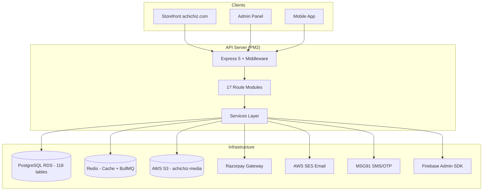

# Achichiz Backend — Complete API & Schema Reference

> **Base URL (Production):** `https://api.achichiz.com`  
> **Base URL (Local):** `http://localhost:4000`  
> **Swagger Docs:** `/docs/storefront/` (public) · `/docs/admin` (staff JWT required)  
> **Stack:** Node 22 · Express 5 · Drizzle ORM · PostgreSQL 17 · Redis 7 · PM2

---

## Architecture Overview

---

## All API Endpoints (97 total)

### 🟢 System (2)
| Method | Path | Auth | Description |
|--------|------|------|-------------|
| `GET` | `/healthz` | Public | Liveness probe — process alive check |
| `GET` | `/readyz` | Public | Readiness probe — checks Postgres + Redis |

---

### 🔐 Customer Auth (9)
| Method | Path | Auth | Description |
|--------|------|------|-------------|
| `POST` | `/v1/auth/signup` | Public | Create account + sign in + merge guest cart |
| `POST` | `/v1/auth/login` | Public | Email + password sign in |
| `POST` | `/v1/auth/otp/request` | Public | Send 6-digit login OTP to mobile |
| `POST` | `/v1/auth/otp/verify` | Public | Verify OTP and sign in (auto-creates account) |
| `POST` | `/v1/auth/refresh` | Public | Exchange refresh cookie for new access token |
| `POST` | `/v1/auth/logout` | Public | Sign out this device |
| `POST` | `/v1/auth/logout-all` | Public | Sign out every device |
| `POST` | `/v1/auth/forgot-password` | Public | Send password-reset email |
| `POST` | `/v1/auth/reset-password` | Public | Complete password reset with token |
| `GET` | `/v1/auth/me` | Customer | Get current signed-in customer |

---

### 📦 Catalogue (14)
| Method | Path | Auth | Description |
|--------|------|------|-------------|
| `GET` | `/v1/products` | Public | List/filter products (grid view) |
| `GET` | `/v1/products/:handle` | Public | Full PDP: gallery, variants, add-ons, SEO |
| `GET` | `/v1/products/:handle/variants` | Public | List variants with stock info |
| `GET` | `/v1/collections` | Public | List collections (category/recipient/occasion/festival/designer/edit) |
| `GET` | `/v1/collections/:handle` | Public | Collection with facets and price bounds |
| `GET` | `/v1/collections/:handle/products` | Public | Products within a collection |
| `GET` | `/v1/designers` | Public | List designers/brands |
| `GET` | `/v1/designers/:handle` | Public | Single designer |
| `GET` | `/v1/add-ons` | Public | Gift wrap, cards, engraving catalogue |
| `GET` | `/v1/personalisation-templates` | Public | Engraving/embroidery methods |
| `GET` | `/v1/hamper-builder/templates` | Public | Build-your-own-hamper templates |
| `GET` | `/v1/hamper-builder/templates/:handle` | Public | Full wizard: steps + options + stock |
| `GET` | `/v1/serviceability` | Public | PIN code delivery check |
| `GET` | `/v1/search` | Public | Full-text product search |

---

### 🔍 Search (3)
| Method | Path | Auth | Description |
|--------|------|------|-------------|
| `GET` | `/v1/search` | Public | Full-text search with filters |
| `GET` | `/v1/search/suggest` | Public | Autocomplete suggestions |
| `GET` | `/v1/search/suggestions` | Public | Popular/saved search suggestions |

---

### 🛒 Cart (9)
| Method | Path | Auth | Description |
|--------|------|------|-------------|
| `GET` | `/v1/cart` | Public | Get cart (empty cart for unknown token) |
| `POST` | `/v1/cart/lines` | Public | Add variant + add-ons + personalisation |
| `PATCH` | `/v1/cart/lines/:lineId` | Public | Update quantity/personalisation |
| `DELETE` | `/v1/cart/lines/:lineId` | Public | Remove a line |
| `DELETE` | `/v1/cart` | Public | Empty entire cart |
| `POST` | `/v1/cart/coupon` | Public | Apply coupon code |
| `DELETE` | `/v1/cart/coupon` | Public | Remove coupon |
| `POST` | `/v1/cart/merge` | Customer | Merge guest cart into account cart |

---

### 💳 Checkout & Payments (3)
| Method | Path | Auth | Description |
|--------|------|------|-------------|
| `POST` | `/v1/checkout/quote` | Public | Get delivery quote with address |
| `POST` | `/v1/payments/razorpay/order` | Customer | Create Razorpay payment order |
| `POST` | `/v1/payments/razorpay/verify` | Customer | Verify Razorpay payment signature |

---

### 📋 Orders (3)
| Method | Path | Auth | Description |
|--------|------|------|-------------|
| `POST` | `/v1/orders` | Customer | Place order from cart |
| `GET` | `/v1/orders/track` | Public | Track order by ID + email/mobile |

---

### 👤 Customer Account (12)
| Method | Path | Auth | Description |
|--------|------|------|-------------|
| `GET` | `/v1/account/profile` | Customer | Get profile |
| `PATCH` | `/v1/account/profile` | Customer | Update profile |
| `GET` | `/v1/account/addresses` | Customer | List saved addresses |
| `POST` | `/v1/account/addresses` | Customer | Add new address |
| `GET` | `/v1/account/addresses/:addressId` | Customer | Get single address |
| `PATCH` | `/v1/account/addresses/:addressId` | Customer | Update address |
| `DELETE` | `/v1/account/addresses/:addressId` | Customer | Delete address |
| `POST` | `/v1/account/addresses/:addressId/default` | Customer | Set as default |
| `GET` | `/v1/account/orders` | Customer | List my orders |
| `GET` | `/v1/account/orders/:orderId` | Customer | Get order detail |
| `POST` | `/v1/account/orders/:orderId/cancel` | Customer | Cancel order |
| `GET` | `/v1/account/wishlist` | Customer | Get wishlist |
| `POST` | `/v1/account/wishlist` | Customer | Add to wishlist |
| `DELETE` | `/v1/account/wishlist/:productId` | Customer | Remove from wishlist |

---

### 📝 Content & CMS (10)
| Method | Path | Auth | Description |
|--------|------|------|-------------|
| `GET` | `/v1/banners` | Public | Promotional banners |
| `GET` | `/v1/cms/sections` | Public | Homepage/landing sections |
| `GET` | `/v1/menus/:key` | Public | Navigation menus (header/footer/mobile) |
| `GET` | `/v1/pages` | Public | List CMS pages |
| `GET` | `/v1/pages/:slug` | Public | Get single page |
| `GET` | `/v1/policies/:slug` | Public | Policy pages (privacy, T&C, etc.) |
| `GET` | `/v1/blog/posts` | Public | Blog post list |
| `GET` | `/v1/blog/posts/:slug` | Public | Single blog post |
| `GET` | `/v1/faqs` | Public | FAQ list |
| `GET` | `/v1/testimonials` | Public | Customer testimonials |
| `GET` | `/v1/seo` | Public | SEO metadata for routes |

---

### 📨 Leads (3)
| Method | Path | Auth | Description |
|--------|------|------|-------------|
| `POST` | `/v1/leads/contact` | Public | Contact form submission |
| `POST` | `/v1/leads/corporate-gifting` | Public | Corporate gifting enquiry |
| `POST` | `/v1/newsletter/subscribe` | Public | Newsletter signup |

---

### 🔔 Webhooks (1)
| Method | Path | Auth | Description |
|--------|------|------|-------------|
| `POST` | `/v1/webhooks/razorpay` | Signature | Razorpay payment event webhook |

---

### 🛡️ Admin Auth (10)
| Method | Path | Auth | Description |
|--------|------|------|-------------|
| `POST` | `/v1/admin/auth/login` | Public | Staff email + password login |
| `POST` | `/v1/admin/auth/refresh` | Public | Refresh staff session |
| `POST` | `/v1/admin/auth/logout` | Public | Staff logout |
| `POST` | `/v1/admin/auth/step-up` | Staff | Re-authenticate for sensitive ops |
| `POST` | `/v1/admin/auth/2fa/setup` | Staff | Begin 2FA TOTP setup |
| `POST` | `/v1/admin/auth/2fa/verify` | Staff | Verify TOTP code |
| `POST` | `/v1/admin/auth/2fa/enable` | Staff | Enable 2FA |
| `POST` | `/v1/admin/auth/2fa/recovery-codes` | Staff | Get recovery codes |
| `POST` | `/v1/admin/auth/password/forgot` | Public | Staff password reset request |
| `POST` | `/v1/admin/auth/password/reset` | Public | Complete staff password reset |
| `GET` | `/v1/admin/me` | Staff | Get current staff user |

---

### 👥 Admin RBAC (7)
| Method | Path | Auth | Description |
|--------|------|------|-------------|
| `GET` | `/v1/admin/roles` | Staff | List roles |
| `GET` | `/v1/admin/roles/:roleId` | Staff | Get role detail |
| `POST` | `/v1/admin/roles/sync` | Staff | Sync roles from config |
| `GET` | `/v1/admin/permissions` | Staff | List permissions |
| `GET` | `/v1/admin/permissions/matrix` | Staff | Full permission matrix |
| `GET` | `/v1/admin/sessions` | Staff | List active staff sessions |
| `DELETE` | `/v1/admin/sessions/:sessionId` | Staff | Revoke a staff session |

---

### 📊 Admin Orders (10)
| Method | Path | Auth | Description |
|--------|------|------|-------------|
| `GET` | `/v1/admin/orders` | Staff | List all orders (filterable) |
| `GET` | `/v1/admin/orders/:orderId` | Staff | Get order detail |
| `GET` | `/v1/admin/orders/transitions` | Staff | Valid status transitions |
| `PATCH` | `/v1/admin/orders/:orderId/status` | Staff | Update order status |
| `POST` | `/v1/admin/orders/:orderId/cancel` | Staff | Cancel order |
| `POST` | `/v1/admin/orders/:orderId/refund` | Staff | Issue refund |
| `POST` | `/v1/admin/orders/:orderId/courier` | Staff | Assign courier/AWB |
| `POST` | `/v1/admin/orders/:orderId/invoice` | Staff | Generate GST invoice |
| `POST` | `/v1/admin/orders/:orderId/notes` | Staff | Add internal note |
| `POST` | `/v1/admin/orders/bulk` | Staff | Bulk order operations |

---

### 🏗️ Admin Resources (1)
| Method | Path | Auth | Description |
|--------|------|------|-------------|
| `GET` | `/v1/admin/resources` | Staff | List admin resource endpoints |

---

## Database Schema (118 tables across 12 contexts)

| Context | Tables | Key Tables |
|---------|--------|------------|
| **Tax** | 4 | `gst_states`, `hsn_codes`, `gst_rates`, `document_number_series` |
| **Identity** | 7 | `roles`, `role_permissions`, `staff_users`, `staff_sessions`, `otp_challenges` |
| **Customers** | 8 | `customers`, `customer_stats`, `addresses`, `recipients`, `wishlist_items`, `customer_sessions` |
| **Catalogue** | 18 | `products`, `product_variants`, `collections`, `designers`, `add_ons`, `reviews`, `builder_templates` |
| **Inventory** | 11 | `warehouses`, `inventory_levels`, `stock_movements`, `suppliers`, `purchase_orders` |
| **Orders** | 11 | `carts`, `cart_lines`, `orders`, `order_lines`, `returns`, `exchanges` |
| **Payments** | 9 | `payments`, `payment_events`, `refunds`, `invoices`, `gift_cards` |
| **Corporate** | 8 | `corporate_leads`, `corporate_accounts`, `quotations`, `campaigns` |
| **Delivery** | 10 | `delivery_zones`, `couriers`, `shipments`, `shipment_events`, `packaging_materials` |
| **Promotions** | 12 | `coupons`, `auto_discounts`, `bundles`, `loyalty_tiers`, `referrals` |
| **Content** | 12 | `media_assets`, `cms_sections`, `banners`, `content_pages`, `blog_posts`, `menus` |
| **Platform** | 8 | `activity_logs`, `notifications`, `integrations`, `webhooks`, `app_settings` |

---

## Key Configuration

| Setting | Value |
|---------|-------|
| **Production API** | `https://api.achichiz.com` |
| **Main Website** | `https://achichiz.com` |
| **Database** | AWS RDS PostgreSQL (ap-south-1) |
| **Object Storage** | AWS S3 `achichiz-media` (ap-south-1) |
| **Payment Gateway** | Razorpay (live keys) |
| **Email** | AWS SES (ap-south-1) |
| **SMS/OTP** | MSG91 (pending DLT setup) |
| **Firebase** | Admin SDK (project: achichiz-in) |
| **Process Manager** | PM2 on Lightsail |
| **Money Format** | Integer paise (149900 = ₹1,499.00) |
| **Percentages** | Basis points (1800 = 18%) |

---

## Middleware Stack

1. **Request Context** — Generates `X-Request-Id` (ULID)
2. **Pino HTTP Logger** — Structured JSON logging
3. **Helmet** — Security headers + CSP
4. **CORS** — Whitelisted origins with credentials
5. **Raw Body Parser** — For webhook signature verification (`/v1/webhooks`)
6. **JSON Parser** — 1MB limit
7. **HPP** — HTTP parameter pollution protection
8. **Rate Limiter** — Global default (120/min) + named limiters (auth: 10/15min, otp: stricter)
9. **Swagger UI** — Mounted at `/docs/storefront/` and `/docs/admin`

---

## Auth Flow Summary

### Customer
- **Primary:** Mobile OTP → `POST /v1/auth/otp/request` → `POST /v1/auth/otp/verify`
- **Secondary:** Email + Password → `POST /v1/auth/login`
- **Token:** Short-lived JWT in response body (15min) + httpOnly `ach_rt` refresh cookie (30 days)
- **Refresh:** `POST /v1/auth/refresh` with rotating tokens + reuse detection

### Staff/Admin
- **Login:** Email + Password → `POST /v1/admin/auth/login`
- **2FA:** TOTP setup → verify → enable
- **Token:** Staff JWT (10min) + refresh cookie
- **Step-up:** Re-authenticate for sensitive operations
