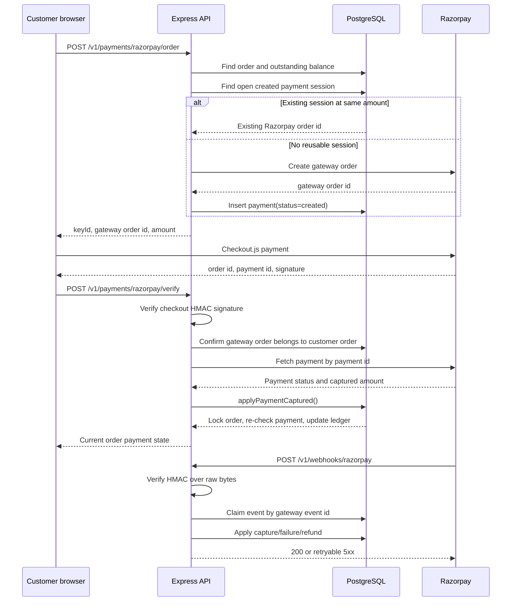
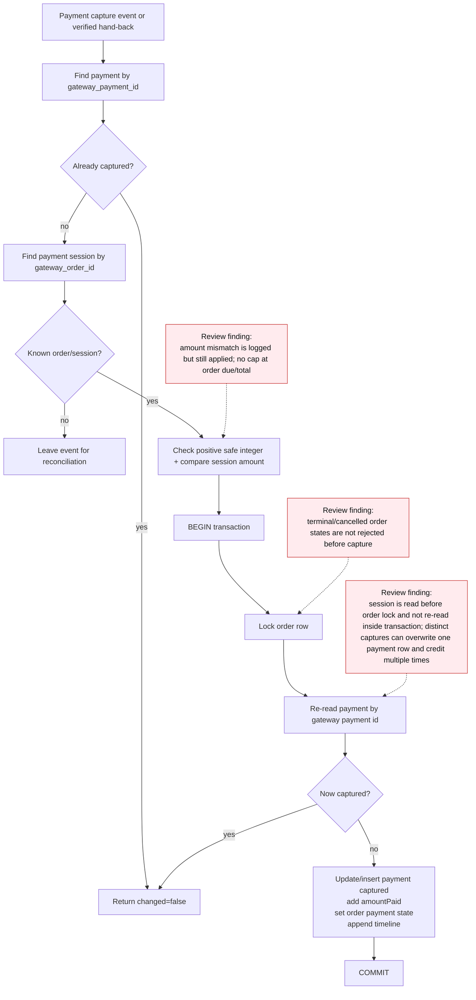
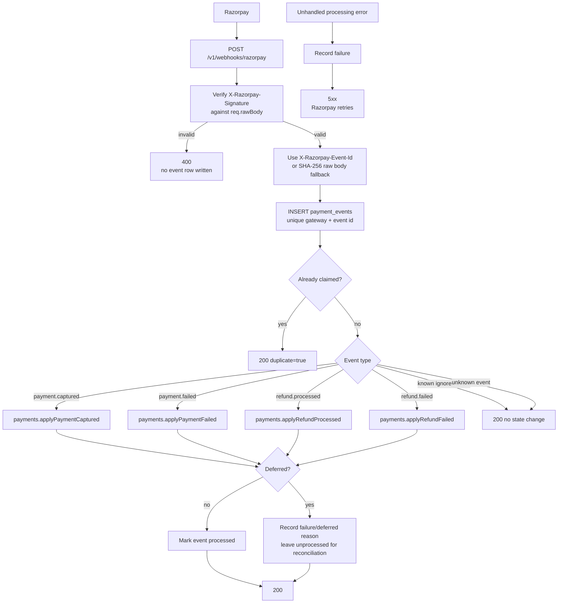
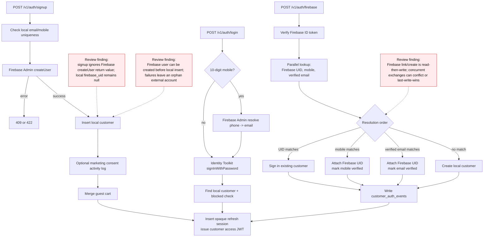
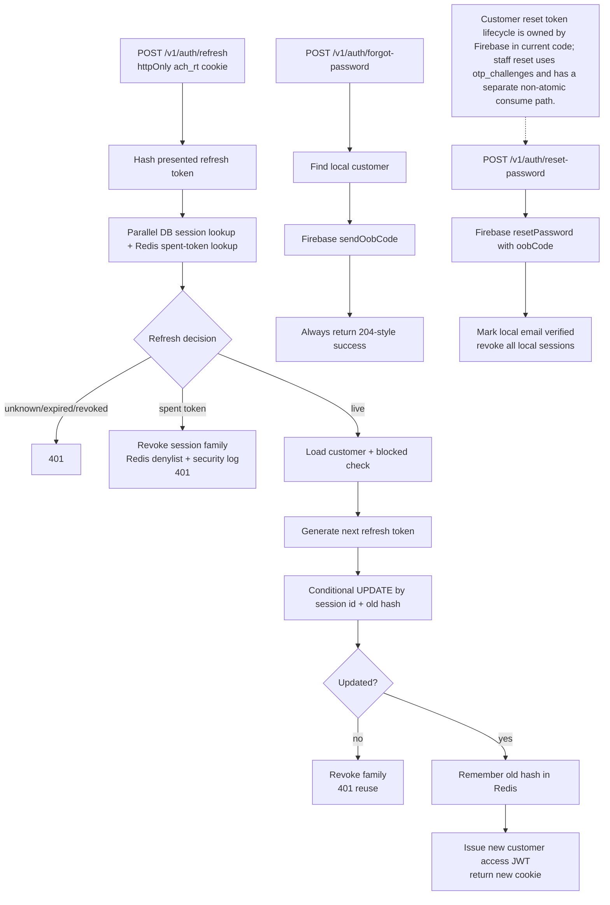
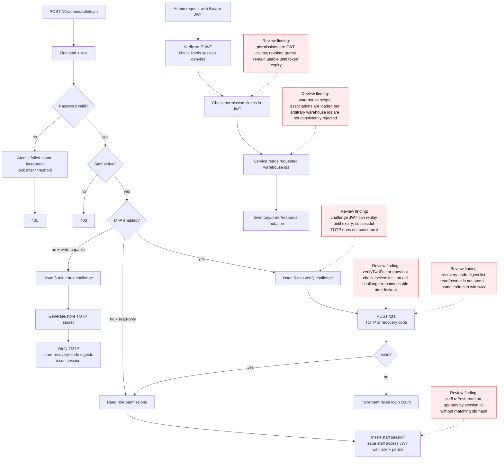
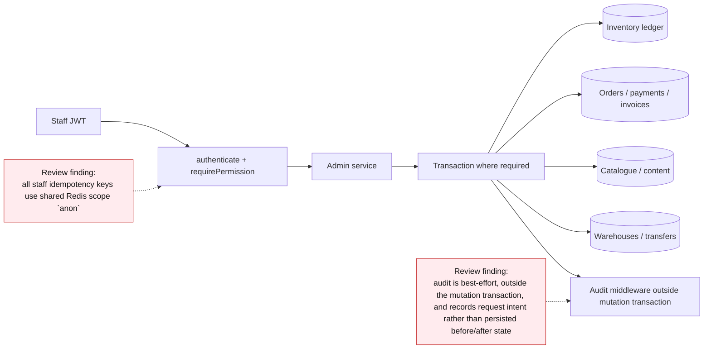
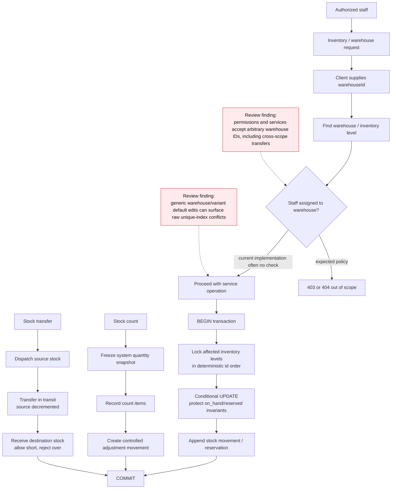
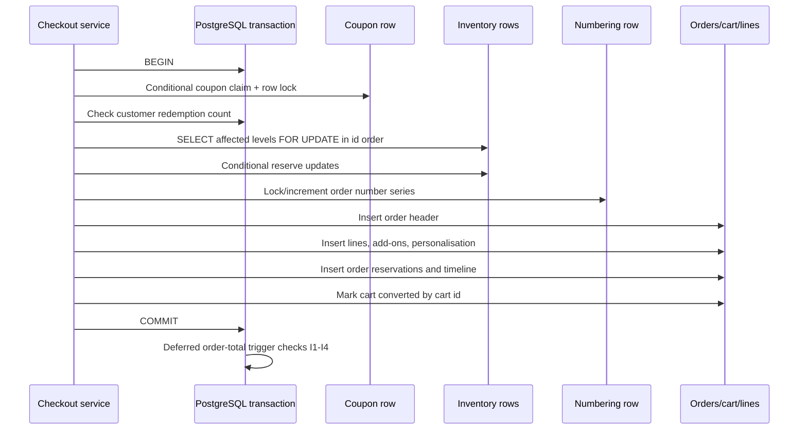

# Achichiz Backend — complete flow diagrams

> **Scope:** this document describes the backend that is currently present in this repository. It is an implementation map, not a proposed redesign. Boxes marked **Review finding** describe behaviour identified during static review and should be treated as part of the current system until remediated.
>
> **Database note:** the database diagrams describe SQL statically. There is no live PostgreSQL integration harness in this checkout, so trigger and migration observations require confirmation against PostgreSQL 16 before deployment.

## 1. System context

```mermaid
flowchart LR
    Store[Storefront browser]
    Admin[Admin console]
    Razorpay[Razorpay API and webhooks]
    Firebase[Firebase Auth]
    SES[SES or development email sender]
    S3[S3 or S3-compatible media storage]

    subgraph Backend[Achichiz backend process]
        HTTP[Express HTTP server]
        Routes[Route declarations\n`defineRoute()`]
        Services[Domain services]
        Repositories[Drizzle repositories]
        Middleware[Auth, validation, rate limit,\nidempotency, audit, upload]
    end

    subgraph Data[Stateful infrastructure]
        PG[(PostgreSQL 16+)]
        Redis[(Redis)]
    end

    Store -->|HTTPS /v1| HTTP
    Admin -->|HTTPS /v1/admin| HTTP
    Razorpay -->|signed HTTPS webhook| HTTP
    HTTP --> Middleware
    Middleware --> Routes
    Routes --> Services
    Services --> Repositories
    Repositories --> PG
    Services --> Redis
    Services --> Razorpay
    Services --> Firebase
    Services --> SES
    Services --> S3

    classDef current fill:#e8f5e9,stroke:#2e7d32,color:#111
    classDef external fill:#e3f2fd,stroke:#1565c0,color:#111
    classDef data fill:#fff3e0,stroke:#ef6c00,color:#111
    classDef finding fill:#ffebee,stroke:#c62828,color:#111
    class Store,Admin,HTTP,Routes,Services,Repositories,Middleware current
    class Razorpay,Firebase,SES,S3 external
    class PG,Redis data
```

### Main responsibilities

| Layer | Current responsibility |
|---|---|
| `src/server.ts` | Creates the Express app, binds the HTTP port, and performs graceful shutdown. |
| `src/app.ts` | Installs request context, logging, Helmet, CORS, raw webhook parsing, JSON/form parsing, HPP, the blanket limiter, Swagger, routes, 404, and error handling. |
| `src/routes.ts` | Imports and mounts health, storefront, admin, media, and webhook routers. |
| `defineRoute()` | Registers an Express route and its OpenAPI operation from one declaration, then builds its middleware chain. |
| Middleware | Authenticates tokens, checks permissions, validates Zod input, claims idempotency keys, uploads multipart files, and records admin mutations. |
| Services | Own business rules, pricing, authorization decisions, state transitions, and transaction orchestration. |
| Repositories | Own Drizzle/PostgreSQL queries and transaction-scoped reads/writes. |
| PostgreSQL | Durable source of truth for customers, staff, catalogue, carts, orders, payments, inventory, media metadata, and audit records. |
| Redis | JWT/session denylist, refresh replay memory, rate-limit store, idempotency store, and step-up state. |
| External integrations | Razorpay payments, Firebase identity, S3 media, and email. SES production delivery is currently a stub. |

## 2. Process boot and shutdown

```mermaid
flowchart TD
    Start[node src/server.ts] --> Env[Import config/env.ts]
    Env --> Parse{Environment schema valid?}
    Parse -- no --> ExitConfig[Log all invalid variables\nprocess exits before port bind]
    Parse -- yes --> Razor[Check Razorpay variable completeness]
    Razor --> Mode[Log live/test key mode warnings]
    Mode --> App[createApp()]
    App --> Context[Request context middleware]
    Context --> Logger[pino-http]
    Logger --> Security[Helmet + CORS + HPP]
    Security --> WebhookParser[Raw body parser for /v1/webhooks]
    WebhookParser --> BodyParser[JSON + URL-encoded parsers]
    BodyParser --> DefaultLimit[Blanket /v1 rate limiter]
    DefaultLimit --> Swagger[Mount Swagger/OpenAPI]
    Swagger --> Router[Mount apiRouter at root]
    Router --> Listen[HTTP server listens on PORT]

    Listen --> Signal{SIGTERM / SIGINT?}
    Signal --> StopAccept[Stop accepting new connections]
    StopAccept --> Drain[Drain in-flight requests]
    Drain --> ClosePG[Close PostgreSQL pools]
    ClosePG --> CloseRedis[Quit Redis clients]
    CloseRedis --> Exit[Exit]

    ConfigRisk[Review finding:\nRazorpay test key in production only logs; it does not stop boot/payment use]
    ConfigRisk -.-> Mode
    classDef risk fill:#ffebee,stroke:#c62828,color:#111
    class ConfigRisk risk
```

### Database migration process

Migrations are intentionally **not** run at application boot.

```mermaid
flowchart LR
    Deploy[Deployment job or\nscripts/deploy-docker.sh] --> Migrate[npm run db:migrate\n(or dist/db/migrate.js)]
    Migrate --> Client[Standalone pg.Client]
    Client --> SchemaTable[CREATE schema_migrations IF NOT EXISTS]
    SchemaTable --> Lock[Acquire PostgreSQL advisory lock]
    Lock --> Files[Read src/dist db/migrations\nin filename order]
    Files --> Checksum[SHA-256 each SQL file]
    Checksum --> Applied{Already recorded?}
    Applied -- yes + same checksum --> Next[Next file]
    Applied -- yes + changed --> Abort[Abort: forward-only migration changed]
    Applied -- no --> Tx[BEGIN]
    Tx --> SQL[Strip outer BEGIN/COMMIT\nthen execute migration SQL]
    SQL --> Record[INSERT filename + checksum]
    Record --> Commit[COMMIT]
    Commit --> Next
    Next --> Unlock[Release advisory lock]
    Unlock --> Close[Close client]
```

**Deployment caveat:** the production Docker Compose file starts an `api` and a `worker` service, but this checkout has no `src/worker.ts`; `npm run start:worker` fails because `dist/worker.js` is absent. The worker container therefore cannot process the intended asynchronous work.

## 3. HTTP request pipeline

Every route declared with `defineRoute()` is assembled into the following pipeline. Middleware that is not applicable to a route is omitted.

```mermaid
flowchart TD
    Request[Incoming HTTP request] --> RequestId[request-context\nvalidate inbound X-Request-Id or generate ULID]
    RequestId --> AccessLog[pino-http request logging\nredacts auth/cookie/token fields]
    AccessLog --> Headers[Helmet + CORS]
    Headers --> Raw{Path starts /v1/webhooks?}
    Raw -- yes --> RawBody[Read raw JSON bytes\nattach req.rawBody\nparse JSON body]
    Raw -- no --> Parsed
    RawBody --> Parsed[express.json / urlencoded + HPP]
    Parsed --> GlobalLimit[/v1 default limiter]
    GlobalLimit --> RouteMatch{Route exists?}
    RouteMatch -- no --> NotFound[404 handler]
    RouteMatch -- yes --> NamedLimit{Named route limiter?}
    NamedLimit --> Auth{Route auth mode?}
    Auth -- public --> Permission
    Auth -- customer --> CustomerJWT[Verify customer JWT\ncheck Redis session denylist\nset req.auth + actor context]
    Auth -- staff --> StaffJWT[Verify staff JWT\ncheck Redis session denylist\nset req.auth + actor context]
    CustomerJWT --> Permission
    StaffJWT --> Permission
    Permission{Permission declared?} -- no --> Idempotency
    Permission -- yes --> RBAC[Check staff permission claim]
    RBAC --> Idempotency{Idempotent route?}
    Idempotency -- no --> Multipart
    Idempotency -- yes --> Claim[Redis GET/NX claim\nreplay or reserve key]
    Claim --> Multipart{multipart/form-data?}
    Multipart -- no --> Validate
    Multipart -- yes --> Multer[Global fileInterceptor\nparse files + upload to S3\nwrite media rows\nmap field to media id]
    Multer --> Validate[Zod params/query/body validation]
    Validate --> Audit{Admin non-GET\nand audit not skipped?}
    Audit -- yes --> AuditWrite[Best-effort activity log]
    Audit -- no --> Handler
    AuditWrite --> Handler[Route handler]
    Handler --> Service[Domain service]
    Service --> Repository[Repository / external provider]
    Repository --> Result[HTTP result helper]
    Result --> PersistIdem[Asynchronously store successful idempotent response]
    Result --> Response[JSON / 204 / raw response]

    Error[Thrown error] --> ErrorHandler[Single error handler]
    ErrorHandler --> Problem[JSON error envelope\nAppError / PG mapping / 500]

    Risk1[Review finding:\nbyUser limiter runs before auth, so req.auth is empty] -.-> NamedLimit
    Risk2[Review finding:\nRedis rate-limit failure is fail-open] -.-> NamedLimit
    Risk3[Review finding:\nX-Forwarded-For is used directly for limiter keys] -.-> NamedLimit
    Risk4[Review finding:\nmultipart upload can happen before validation] -.-> Multer

    classDef risk fill:#ffebee,stroke:#c62828,color:#111
    class Risk1,Risk2,Risk3,Risk4 risk
```

### Route declaration and OpenAPI flow

```mermaid
flowchart LR
    Declaration[RouteSpec in module.routes.ts] --> Register[registry.add(spec)]
    Declaration --> Chain[Build Express middleware chain]
    Chain --> Express[Express router method/path]
    Register --> Document[buildDocument(surface)]
    Document --> Committed[openapi/openapi.admin.json\nopenapi/openapi.storefront.json]
    Document --> UI[Swagger UI]
    Runtime[Live Express router stack] --> Coverage[OpenAPI coverage test]
    Register --> Coverage

    PublicUI[/docs and /docs/] --> StorefrontUI[Public Storefront Swagger UI]
    AdminUI[/docs/admin/] --> Guard[guardAdminDocs]
    Guard --> AdminDocument[Embedded Admin Swagger UI]
    AdminJSON[/openapi/admin.json] --> Guard
    StorefrontJSON[/openapi/storefront.json] --> StorefrontUI
    README[README documents\n/docs/admin + /docs/storefront] -.-> PublicUI

    classDef risk fill:#ffebee,stroke:#c62828,color:#111
    class Guard risk
```

**Current API documentation state:** `/docs/` and `/openapi/storefront.json` are public. `/docs/admin/` and `/openapi/admin.json` use the existing IP/staff guard; the Admin document is embedded only after the guard succeeds, so the public Storefront UI does not need to fetch it. `/docs/admin` accepts the documented short-lived `access_token` query parameter for browser navigation, while API clients may use `Authorization`. The README’s `/docs/storefront` path is an alias of the public Storefront UI, not a business API.

## 4. Route surface map

```mermaid
flowchart TB
    API[/apiRouter]
    API --> System[System\nhealth / readiness]
    API --> Store[Storefront]
    API --> Admin[Admin]
    API --> Webhooks[Webhooks]

    Store --> Catalogue[Catalogue\nproducts, collections, content]
    Store --> Search[Search\nFTS, suggestions, tracking]
    Store --> Cart[Cart\nlines, coupons, merge]
    Store --> Checkout[Checkout\nquote, create order]
    Store --> Orders[Customer orders\nlist, detail, cancel, track]
    Store --> Payments[Customer payments\nRazorpay order, verify]
    Store --> CustomerAuth[Customer auth\nsignup, login, Firebase, refresh, logout]
    Store --> Account[Account + addresses]
    Store --> Leads[Lead capture\ncontact, corporate, newsletter]
    Store --> CustomerMedia[Customer media upload]

    Admin --> AdminAuth[Staff auth\nlogin, MFA, reset, sessions, step-up]
    Admin --> RBAC[Roles + permissions]
    Admin --> Resources[Generic admin resources]
    Admin --> Inventory[Inventory + stock movements]
    Admin --> Warehousing[Warehouses, locations, transfers]
    Admin --> Purchasing[Suppliers, purchase orders, goods receipt]
    Admin --> Bundles[Bundles / availability]
    Admin --> Production[Production / BOM]
    Admin --> Counts[Stock counts]
    Admin --> Barcodes[Barcode operations]
    Admin --> Bulk[Bulk orders]
    Admin --> Reports[Reports + CSV export]
    Admin --> AdminOrders[Order operations, refunds, invoices]
    Admin --> AdminMedia[Admin media upload]

    Webhooks --> Razor[POST /v1/webhooks/razorpay]
```

## 5. Storefront browse and search flow

```mermaid
flowchart LR
    Shopper[Browser] --> CatalogRoute[Catalogue/content route]
    CatalogRoute --> CatalogService[Catalogue service]
    CatalogService --> CatalogRepo[Catalogue repository]
    CatalogRepo --> PG[(PostgreSQL)]
    PG --> CatalogRepo
    CatalogRepo --> CatalogService
    CatalogService --> Shopper

    Shopper --> SearchRoute[GET /v1/search\n/suggest\n/suggestions]
    SearchRoute --> SearchService[Search service]
    SearchService --> SearchRepo[Search repository]
    SearchRepo --> FTS[PostgreSQL FTS + trigram]
    FTS --> SearchRepo
    SearchRepo --> SearchService
    SearchService --> Shopper

    Vocabulary[search_vocabulary\nmaterialized read model] -. no discovered refresh job .-> FTS
    WideIndex[Indexed product_search_document() helper] -. repository re-spells expression .-> FTS

    classDef risk fill:#ffebee,stroke:#c62828,color:#111
    class Vocabulary,WideIndex risk
```

**Search review findings:**

- The three public search endpoints deliberately have no named `search` limiter because the current limiter implementation constructs Redis-backed stores too early for the OpenAPI generator. They receive only the blanket limit.
- `search_vocabulary` has no discovered refresh command/job, so suggestions can become stale.
- The repository does not call the migration's `product_search_document()` helper. Its query expression is not structurally identical to the wide FTS index expression, reducing the reliability of that index.
- Search suggestions run several database operations in parallel and have no dedicated tighter limiter, making them a scraping/database-load target.

## 6. Cart lifecycle and merge flow

```mermaid
flowchart TD
    Browser[Browser] --> Token[Cart identity\nX-Cart-Token preferred\nbody/query fallback]
    Token --> Resolve{Token present?}
    Resolve -- no --> NewCart[Create anonymous cart\nnewCartToken()]
    Resolve -- yes --> FindCart[Find cart by anon_token]
    FindCart --> Owner{Cart owned by another customer?}
    Owner -- yes --> Hide[404 to avoid ownership disclosure]
    Owner -- no --> Open{Cart converted?}
    NewCart --> LineAction
    Open -- yes --> Converted[422 cart_already_converted]
    Open -- no --> LineAction[Add / update / delete / clear / coupon]

    LineAction --> LiveRows[Read live product, variant, add-on,\nGST, collection, inventory rows]
    LiveRows --> Price[Pure pricing engine\nrecompute totals and tax]
    Price --> CartResponse[Return cart + warnings]

    Login[Successful customer login/Firebase exchange] --> Merge[mergeCart(customerId, guestToken)]
    Merge --> Existing[Find customer's open cart]
    Merge --> Guest[Find guest cart]
    Existing --> Choice{Customer cart exists?}
    Guest --> Choice
    Choice -- no --> Adopt[Adopt guest cart or create customer cart]
    Choice -- yes --> Lines[For each guest line]
    Lines --> Clash{Same line_key?}
    Clash -- yes --> Sum[Add quantities, delete guest line]
    Clash -- no --> Move[Move guest line]
    Sum --> CouponMerge[Optional coupon merge]
    Move --> CouponMerge
    Adopt --> Loaded
    CouponMerge --> DeleteGuest[Delete guest cart]
    DeleteGuest --> Loaded[Reload + reprice]
    Loaded --> Browser

    Race1[Review finding:\ncart line reads/writes are not atomic; concurrent adds can lose quantity] -.-> LineAction
    Race2[Review finding:\nmerge has no transaction/customer/cart locks] -.-> Merge
    Race3[Review finding:\nno unique active customer-cart constraint] -.-> Existing

    classDef risk fill:#ffebee,stroke:#c62828,color:#111
    class Race1,Race2,Race3 risk
```

### Important cart semantics

- A cart stores a live product/variant reference and a price snapshot for display only. Totals are recomputed from current catalogue rows.
- Builder hamper lines are accepted by the request schema but rejected by the service as `builder_lines_unsupported`; their bill-of-materials reservation flow is not implemented.
- `availableQtyFor()` used by cart reads does not filter inactive/deleted warehouses, while checkout inventory selection does. Cart availability can therefore overstate sellable stock before checkout rejects it.
- `X-Cart-Token` is included in both the CORS `allowedHeaders` and `exposedHeaders` lists, so an approved cross-origin storefront can use the documented preferred header.

## 7. Quote, order creation, and cart conversion

```mermaid
flowchart TD
    Customer[Authenticated customer] --> Quote[POST /v1/checkout/quote]
    Quote --> ResolveQuote[Resolve owned cart + address]
    ResolveQuote --> PriceQuote[Load live rows\nprice cart + tax + delivery]
    PriceQuote --> QuoteResponse[Quote only\nno stock hold / no coupon claim]

    Customer --> Create[POST /v1/orders\nIdempotency-Key required]
    Create --> Idem[Redis idempotency reservation]
    Idem --> Context[Resolve cart, address, zone, supply point\nload live pricing state]
    Context --> Assert[Assert sellability, delivery, COD,\nstock and pricing invariants]
    Assert --> Tx[BEGIN PostgreSQL transaction]
    Tx --> Coupon{Coupon?}
    Coupon -- yes --> CouponLock[Claim coupon with conditional UPDATE\nlock coupon row]
    Coupon -- no --> Inventory
    CouponLock --> CustomerCoupon[Check per-customer redemption limit]
    CustomerCoupon --> Inventory[Lock selected inventory levels\nin ascending id order]
    Inventory --> Reserve[Conditional reserve\non_hand - reserved >= quantity]
    Reserve --> Number[Take order number]
    Number --> Header[Insert order header]
    Header --> Lines[Insert order lines + add-ons + personalisation]
    Lines --> Reservations[Insert order reservations]
    Reservations --> Redemption[Insert coupon redemption]
    Redemption --> Timeline[Insert order timeline events]
    Timeline --> AddressSave[Optional save shipping address]
    AddressSave --> Convert[UPDATE carts\nSET stage=converted, converted_order_id=order]
    Convert --> Commit[COMMIT + deferred checks]
    Commit --> Gateway{Prepaid?}
    Gateway -- no --> CODResponse[Return confirmed / cod_due]
    Gateway -- yes --> CreateRP[Create/reuse Razorpay session AFTER commit]
    CreateRP --> PaymentResponse[Return pending_payment + payment session\nor null if gateway failed]

    Risk[Review finding:\nmarkCartConverted() updates by cart id unconditionally; concurrent submissions with different idempotency keys can create multiple orders and overwrite converted_order_id] -.-> Convert
    Risk2[Review finding:\nby-user idempotency scope is unavailable to staff and async response persistence can lose the reservation] -.-> Idem

    classDef risk fill:#ffebee,stroke:#c62828,color:#111
    class Risk,Risk2 risk
```

### Checkout invariant set

The service and deferred SQL trigger intend to enforce:

1. `orders.subtotal_paise = SUM(order_lines.gross_paise)`.
2. Header discount totals equal allocated line discounts.
3. `orders.total_paise = subtotal + shipping + COD fee + round-off`.
4. Header tax totals equal line tax totals.

The implementation correctly places gateway I/O after the order transaction so a slow Razorpay request does not hold inventory and numbering locks. The cart-conversion write is the missing serialization boundary: it must atomically claim the cart before creating order effects, not merely mark it converted at the end.

## 8. Payment and refund flow

### 8.1 Customer payment flow



### 8.2 Capture decision flow



### 8.3 Cancellation and refunds

```mermaid
flowchart TD
    CustomerCancel[Customer cancel request] --> Lock[Lock customer order]
    Lock --> Cancellable{Pre-shipped state?}
    Cancellable -- no --> Refuse[422 not cancellable]
    Cancellable -- yes --> Release[Release order reservations\nreverse coupon redemption]
    Release --> Paid{Amount paid?}
    Paid -- no --> Cancelled[Set status=cancelled\nappend timeline]
    Paid -- yes --> RefundState[Set status=refund_initiated\nappend timeline]
    RefundState --> Commit[COMMIT]
    Cancelled --> Response[Return order]
    Commit --> Refund[Start payments.refundOrder() after commit]

    AdminRefund[Admin refund endpoint] --> RefundService[Lock order + read captured payments\ncalculate committed refund cap]
    RefundService --> Mode{Captured Razorpay payment?}
    Mode -- yes --> RazorpayRefund[Call Razorpay refund]
    Mode -- no --> BankTransfer[Create bank-transfer refund record]
    RazorpayRefund --> RefundRow[Persist refund state / idempotency]
    BankTransfer --> RefundRow
    RefundRow --> Response

    Race[Review finding:\ncaptured payment lookup occurs before order lock, so a concurrent capture can be misclassified as bank transfer] -.-> Mode
    State[Review finding:\nrefund state is read before locking; concurrent changes can alter classification] -.-> RefundService
    Capture[Review finding:\ncapture path can accept cancelled/refund states and does not initiate compensating refund] -.-> RefundState

    classDef risk fill:#ffebee,stroke:#c62828,color:#111
    class Race,State,Capture risk
```

## 9. Razorpay webhook flow



The code comments describe this as atomic, but the review found that claiming/dispatch behaviour still needs live concurrency testing. In particular, a failure/deferred row and an in-flight duplicate must be tested with two simultaneous deliveries rather than inferred from unit tests.

## 10. Customer authentication flow

### 10.1 Password signup/login and Firebase exchange



### 10.2 Customer refresh and password reset



## 11. Staff/admin authentication and request authorization



### Staff operations after authorization



## 12. Inventory and warehouse flow



## 13. Media upload flow

```mermaid
flowchart TD
    Client[Multipart request] --> Route[Admin or customer media route]
    Route --> DefineRoute[defineRoute adds fileInterceptor\nbecause bodyContentType is multipart]
    DefineRoute --> GlobalMulter[Multer upload.any()]
    GlobalMulter --> Each[For each req.files entry]
    Each --> S3[Upload object to S3]
    S3 --> MediaRow[Insert media_assets row]
    MediaRow --> BodyMap[Set req.body[fieldname] = asset.id]
    BodyMap --> Validate[Later Zod validation]
    Validate --> Handler[Route handler invokes upload.single('file')]
    Handler --> SecondMulter[Second Multer parser]
    SecondMulter --> Missing{req.file present?}
    Missing -- no --> Broken[400 No file provided]
    Missing -- yes --> Service[Upload/persist again]

    Orphan[Review finding:\nfirst upload can remain in S3 + media_assets if downstream validation or a later service step fails] -.-> MediaRow
    Security[Review finding:\nMIME/extension are client-controlled; no content sniffing, file-count, or aggregate-volume cap] -.-> Each
    Ownership[Review finding:\ncustomer media has no ownership field; admin upload only requires dashboard:view] -.-> MediaRow

    classDef risk fill:#ffebee,stroke:#c62828,color:#111
    class Broken,Orphan,Security,Ownership risk
```

## 14. Database transaction and trigger flow

### Order creation transaction



### Static SQL trigger concerns

```mermaid
flowchart TD
    LineChange[INSERT/UPDATE/DELETE order_lines] --> Trigger[Deferred trg_order_totals_lines]
    HeaderChange[Watched UPDATE on orders header totals] --> TriggerHeader[Deferred trg_order_totals_header]
    Trigger --> Function[check_order_totals()]
    TriggerHeader --> Function
    Function --> Lookup[SELECT order by coalesce(NEW.order_id, NEW.id)]
    Lookup --> Totals[SUM active order-line gross/discount/tax]
    Totals --> Checks[I1 subtotal\nI2 discounts\nI3 total\nI4 tax]
    Checks --> Commit[Allow or reject COMMIT]

    Bug[Static finding:\norders trigger rows have no order_id; `NEW.order_id` is not an orders column. Requires live PostgreSQL confirmation when the header trigger fires.] -.-> Lookup
    Mismatch[Static finding:\nSQL split_inclusive_tax() and TypeScript tax logic are not identical around cess, although the application does not currently call the SQL function.] -.-> Function
    Date[Static finding:\ninvoice service uses UTC FY while SQL indian_fy() uses Asia/Kolkata] -.-> Checks

    classDef risk fill:#ffebee,stroke:#c62828,color:#111
    class Bug,Mismatch,Date risk
```

### Database areas

```mermaid
mindmap
  root((PostgreSQL))
    Identity
      customers
      staff_users
      sessions
      roles and permissions
      api_keys schema only
      OTP challenges
    Catalogue
      products
      variants
      collections
      add-ons
      personalisation
      builders
      media links
    Commerce
      carts
      cart lines
      orders
      order lines
      addresses
      coupons
    Payments
      payment sessions
      payment events
      refunds
      invoices
      credit notes
    Inventory
      warehouses
      locations
      inventory levels
      reservations
      stock movements
      transfers
      counts
      production
      purchasing
    Platform
      activity logs
      notifications
      webhooks
      webhook deliveries
      import jobs
      app settings
      search vocabulary
```

## 15. Background jobs and delivery flow

```mermaid
flowchart LR
    API[API request] --> DB[Persist durable state]
    DB --> Intended[Intent to enqueue async work]
    Intended --> Queue[(BullMQ / Redis)]
    Queue --> Worker[Expected src/worker.ts / dist/worker.js]
    Worker --> SES[Email]
    Worker --> Notifications[Notifications / reconciliation / refresh jobs]

    Current[Current repository] -. no worker source or dist worker .-> Worker
    Leads[Lead service currently sends email synchronously\ninside request path] -.-> SES
    SESStub[Production SES sender intentionally rejects\n(no AWS SES client implemented)] -.-> SES
    SearchRefresh[No discovered search_vocabulary refresh job] -.-> Queue

    classDef risk fill:#ffebee,stroke:#c62828,color:#111
    class Current,Leads,SESStub,SearchRefresh risk
```

**Operational consequence:** a lead request can be saved successfully while its synchronous notification fails, and production password-reset/admin-reset or lead email delivery is not actually implemented unless a different sender is injected. The Compose worker cannot currently start.

## 16. Idempotency, rate limiting, audit, and failure paths

```mermaid
flowchart TD
    Request[Mutation request] --> Rate[Global + named rate limiter]
    Rate --> Key{Idempotency-Key?}
    Key -- required route --> RedisGet[GET idem:scope:key]
    RedisGet --> Existing{Existing value?}
    Existing -- stored response --> Replay[Return stored response]
    Existing -- pending --> Conflict[409 in flight]
    Existing -- none --> NX[SET pending NX EX 300]
    NX --> Handler[Run mutation]
    Handler --> Response[Send response]
    Response --> AsyncStore[Fire-and-forget Redis SET success\nor DEL failure]

    AdminMutation[Admin mutation] --> AuditWrite[Best-effort activity log]
    AuditWrite --> DomainMutation[Domain transaction]

    RedisDown[Redis store error] --> FailOpen[passOnStoreError=true\nrequest proceeds without named limit]
    Proxy[X-Forwarded-For header] --> Spoof[Client can influence IP key]
    AuthOrder[Limiter before authenticate] --> NoUser[byUser key falls back to IP]

    Scope[Current scopes:\ncustomer id for customer routes; `anon` for staff] --> Collision[Staff keys collide across users]
    AsyncStore --> Crash[Process/network failure before write\nretry can repeat side effect]
    PendingTTL[Handler active > 300s] --> Expire[Pending claim expires\nsecond request can start]

    classDef risk fill:#ffebee,stroke:#c62828,color:#111
    class FailOpen,Spoof,NoUser,Collision,Crash,Expire risk
```

## 17. Build, test, lint, and audit flow

```mermaid
flowchart TD
    Checkout[Repository checkout] --> Install[npm ci --ignore-scripts]
    Install --> Test[npm test]
    Install --> Typecheck[npm run typecheck]
    Install --> Build[npm run build]
    Install --> Lint[npm run lint]
    Install --> Audit[npm audit --omit=dev]
    Install --> OpenAPI[Expected OpenAPI/doc scripts]
    Install --> Worker[Expected worker start]

    Test --> TestResult[676/676 tests passed]
    Typecheck --> TypeResult[Passed]
    Build --> BuildResult[Passed]
    Lint --> LintResult[52 errors]
    Audit --> AuditResult[6 moderate production vulnerabilities]
    OpenAPI --> OpenAPIResult[Scripts absent:\nopenapi:generate, openapi:lint, docs:generate]
    Worker --> WorkerResult[dist/worker.js absent]

    Coverage[Passing unit tests] -.-> Gap[No real HTTP, PostgreSQL migration, Redis, S3,\nRazorpay, SES, or endpoint authorization integration coverage]
    TestResult -.-> Gap

    classDef pass fill:#e8f5e9,stroke:#2e7d32,color:#111
    classDef fail fill:#ffebee,stroke:#c62828,color:#111
    class TestResult,TypeResult,BuildResult pass
    class LintResult,AuditResult,OpenAPIResult,WorkerResult,Gap fail
```

## 18. Review priority map

| Priority | Area | Current flow impact | Main locations |
|---|---|---|---|
| **P0 / immediate** | Secret exposure | The hardcoded remote fallback has been removed from the working tree, but the exposed credential remains in repository history and must be rotated/revoked and purged from history/caches. | `drizzle.config.ts`, commit `002a74a3d9563b959cd0469246467fe0bd39b054` |
| **P0 / immediate** | Payment settlement | Captures can be applied after cancellation/refund states, captured amounts are not capped, and stale session state can double-credit or overwrite captures. | `src/modules/payments/payments.service.ts` |
| **P0 / immediate** | Staff MFA | Old challenge tokens can replay; lockout is not consulted in MFA verification; recovery-code consumption is read/rewrite rather than atomic. | `src/modules/admin-auth/admin-auth.service.ts` |
| **P1** | Checkout/cart ownership | Concurrent submissions can create multiple orders from one cart; unconditional cart conversion leaves multiple durable orders. | `src/modules/checkout/checkout.service.ts`, `checkout.repository.ts` |
| **P1** | Media upload | The dedicated double parser is removed, but the shared interceptor still persists before downstream validation; MIME/content sniffing, ownership, file limits, and S3/DB cleanup remain. | `src/middleware/file-interceptor.ts`, `src/modules/media/*` |
| **P1** | Warehouse authorization | A staff user can supply warehouse IDs outside their assigned scope in multiple inventory/transfer/report paths. | `src/modules/admin-*`, staff warehouse scope repository |
| **Done / follow-up** | Admin docs | Admin OpenAPI JSON and UI now use `guardAdminDocs`; the Storefront UI and JSON remain public. Authorized documentation access should be tested with a real staff token. | `src/lib/openapi/swagger.ts` |
| **P1** | Production operations | Worker entrypoint is absent; SES production sender is a rejecting stub; deployment does not provide the promised asynchronous processing. | `src/`, `Dockerfile`, `docker-compose.prod.yml`, `src/integrations/ses/index.ts` |
| **P2** | Auth consistency | Firebase signup does not save returned UID, Firebase linking is race-prone, and external account creation has no compensation. | `src/modules/auth/auth.service.ts`, `firebase-auth.service.ts` |
| **P2** | Refresh/idempotency | Staff refresh rotation is non-conditional; staff keys share `anon`; successful response persistence is asynchronous. | `src/modules/admin-auth/admin-auth.service.ts`, `src/middleware/idempotency.ts` |
| **P2** | Search/API delivery | Search limiter is absent and vocabulary has no refresh path. The cart token CORS allow/expose headers are now configured. | `src/modules/search/search.routes.ts`, `src/modules/cart/*`, `src/app.ts` |
| **P2** | Database correctness | Order trigger references an order row field that does not exist; invoice FY calculation uses UTC in TypeScript versus IST in SQL. | `src/db/migrations/0001_initial.sql`, `admin-orders.service.ts` |
| **P2** | Build hygiene | Lint fails, production audit has six moderate findings, and documentation scripts are missing. | `package.json`, lint output, `npm audit` |

## 19. Recommended end-to-end execution order

```mermaid
flowchart TD
    A[1. Rotate/revoke committed credential\nand purge history/caches] --> B[2. Block unsafe production startup\nDB TLS, Razorpay mode, Firebase/S3/SES readiness]
    B --> C[3. Fix payment state machine\nterminal checks, amount caps, locked re-reads]
    C --> D[4. Atomically claim carts and\nmake payment/session operations idempotent]
    D --> E[5. Fix staff MFA and refresh\nconditional consumption/rotation]
    E --> F[6. Enforce warehouse scope\nat service/repository boundary]
    F --> G[7. Finish media hardening\nvalidate/sniff/cleanup files]
    G --> H[8. Add worker + durable outbox/jobs\nimplement SES]
    H --> I[9. Add real integration tests\nPostgres, Redis, HTTP, S3, Razorpay]
    I --> J[10. Fix lint/audit and restore\nOpenAPI generation gates]
    J --> K[11. Re-run production readiness review]
```
